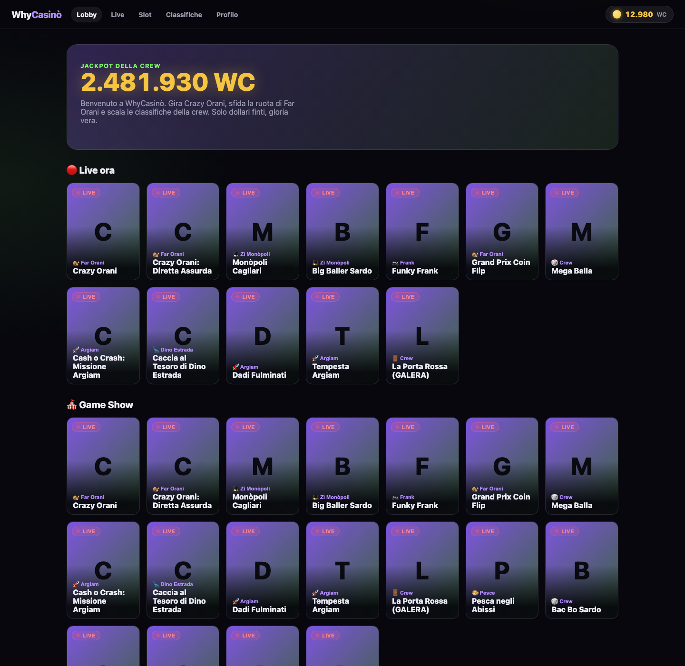
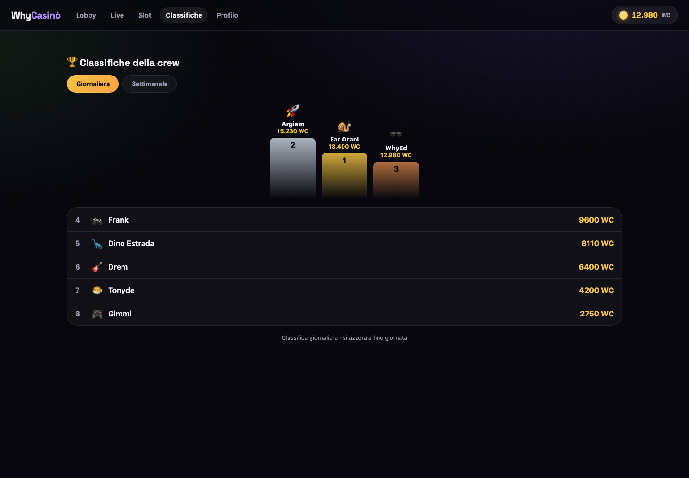
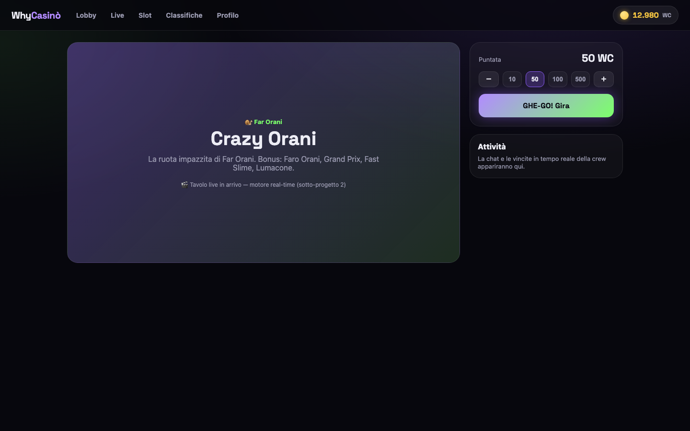

<h1 align="center">🎰 WhyCasinò</h1>

<p align="center">
  <b>Il social casino folle.</b> Slot e live casino stile Evolution/Stake, dollari finti,
  personaggi e lore basati su Far Orani e i suoi fedeli compagni. Ispirato a 888/Stake ma completamente originale.
</p>

<p align="center">
  <a href="https://whycasino.pages.dev"><b>▶️ Gioca ora — whycasino.pages.dev</b></a>
</p>

> ⚠️ **Solo intrattenimento.** Valuta esclusivamente virtuale (WhyCoins). Nessun denaro reale,
> nessun deposito, nessun prelievo. Un gioco tra amici.

---



## ✨ Cosa c'è

- **Catalogo a parità Evolution** — ~50 giochi tra game show, roulette, blackjack, baccarat,
  poker e slot, ognuno con la sua micro-lore nel mondo della crew.
- **Giochi live** pensati per girare in tempo reale lato server (sempre accesi, anche a zero
  utenti) — architettura Cloudflare Durable Objects.
- **Personaggi originali** dagli amici: 🐌 Far Orani (*Crazy Orani*), 🏍️ Frank (*MotorFrank*),
  🚀 Argiam, 🦕 Dino Estrada, 🐡 il Pesce, 🎸 Drem.
- **Classifiche** giornaliere e settimanali della crew.
- **Achievement** che sbloccano WhyCoins.
- **Design system** dark-neon riusabile, vivo e responsive.

<p align="center">
  
  
</p>

## 🏗️ Architettura

Monorepo **pnpm**:

| Pacchetto | Ruolo |
|---|---|
| `apps/web` | Frontend React + Vite (la shell) |
| `packages/ui` | Design system: token + componenti |
| `packages/shared` | Tipi dominio + logica condivisa |
| `services/engine` | *(in arrivo)* motore giochi live — Cloudflare Workers + Durable Objects |

**Stack:** React 18, TypeScript, Vite, Framer Motion, React Router, Vitest. Deploy su Cloudflare Pages.

## 🚀 Sviluppo

```bash
pnpm install
pnpm dev        # avvia la shell su localhost
pnpm test       # test (logica classifiche)
pnpm build      # build di produzione
```

## 🗺️ Roadmap

- [x] **Shell & Design System** — lobby, categorie, gioco, classifiche, profilo
- [ ] **Motore giochi live** — game loop server-side (Crazy Orani per primo), provably-fair
- [ ] **Slot** — RNG per giro
- [ ] **Economia** — auth crew, wallet persistente, achievement server-side
- [ ] **Asset generati** — loghi/copertine/personaggi via Gemini (Nano Banana), volti coerenti

## 📖 Documentazione

- Lore e personaggi: [`docs/lore/LORE.md`](docs/lore/LORE.md)
- Catalogo giochi: [`docs/lore/GAMES.md`](docs/lore/GAMES.md)
- Pipeline asset: [`docs/lore/ASSETS.md`](docs/lore/ASSETS.md)

---

<p align="center"><i>Fatto con ❤️ per la crew. GHE-GO!</i></p>
